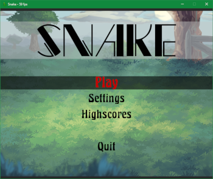
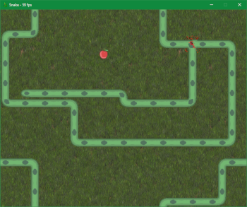
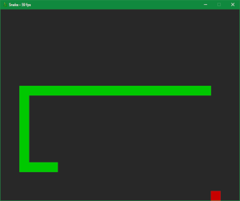
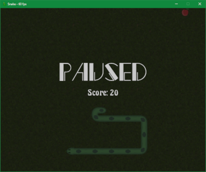
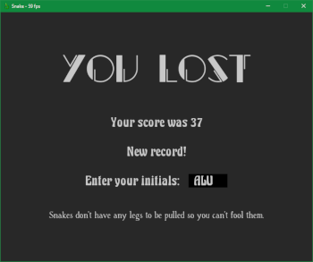
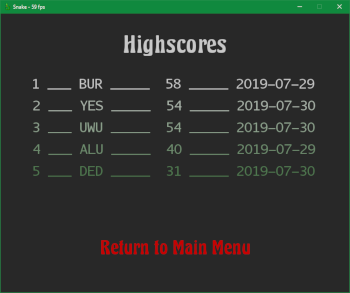
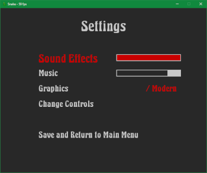
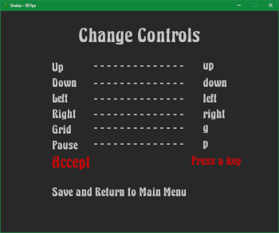

<h2 align="center"> Snake game</h2>

This is a Python implementation of the classic game "Snake", with a menu system that lets you configure the game tweaking different settings.

- [How to play](#how-to-play)
- [Features](#features)
- [Modules used](#modules-used)
- [Requirements](#requirements)
- [Installation](#installation)
- [Screenshots](#screenshots)
- [Credits](#credits)
- [License](#license)

---

### How to play
- Use the arrow keys to move the snake up, down, left and right.
- Feed the snake with apples but avoid making it crash into its body.
- If the snake leaves the screen, it will appear at the opposite edge.
- Press 'P' to pause the game. Press 'P' again to unpause it.
- Press 'G' to show a grid over the game screen.
- Press 'Escape' to exit the game at any moment.

---

### Features
- Infinite screen, it makes the game more dynamic and confusing.
- Pause, so you can get some apples from the kitchen.
- Modern and classic look, in case you are a nostalgic.
- Change key bindings, you don't have to use the arrow keys if you don't want to (or don't have them).
- Set volume of music and sound effects separately.
- TOP5 highscores, show your friends how skilled you are!

---

### Modules used
- os
- math
- json
- copy
- queue
- typing
- random
- pathlib
- functools
- datetime
- pygame

---

### Requirements
Requires Python 3.6+ (with pip).

---

### Installation
Clone the repository or download and extract the zip or tarball file in an empty folder on your computer.

Navigate until the recently created folder and install dependencies (this will install pygame modules):

- Pipenv:

        pipenv install

- Pip:

        pip install -r requirements.txt

Run the game:

- Pipenv:

        pipenv run snake.py

- Other:

        python snake.py

Enjoy.

---

### Screenshots

---

### Credits
* images:
    * icon.png: (modified from original) kungfu4000 in https://opengameart.org/content/snake-enemy-kit-32x32 under public domain.
    * tile-game1.png, tile-game2.png: surfacecurve in https://opengameart.org/content/grass-textureseamless-2d under public domain.
    * bg-menu1.png, bg-menu1b.png, bg-menu2.png, bg-menu2b.png: Nidhoggn in https://opengameart.org/content/backgrounds-3 under public domain.

* fonts:
    * AurulentSansMono-Regular.otf: Stephen G. Hartke in https://www.dafont.com/es/aurulent-sans-mono.font under Public Domain/GPL/OFL.
    * Excalibur Nouveau.ttf: Typo-Graf in https://www.dafont.com/es/excalibur-nouveau.font under Public Domain.
    * HanSrf.ttf: Gerhard Großmann in https://www.dafont.com/es/handserif.font under Public Domain/GPL/OFL.
    * Jacked.ttf: Lucas Cobb Designs in https://www.dafont.com/es/jacked.font under Public Domain/GPL/OFL.

* sounds and music:
    * menu-accept.wav: (modified from original) Kibblesbob in http://soundbible.com/1785-Skorpion.html under Public Domain.
    * menu-select.wav: (modified from original) Lisa Redfern in http://soundbible.com/2082-Hammering.html under Public Domain.
    * snake-bite.wav: (modified from original) GregoryWeir in http://soundbible.com/1394-Dragon-Bite.html under Public Domain.
    * snake-crash.wav: (modified from original) Vladimir in http://soundbible.com/1952-Punch-Or-Whack.html under Public Domain.
    * menu-music.ogg: (modified from original) aldo in http://soundbible.com/1546-Hiking-A-Trail.html under Public Domain.
    * snake-music-Rafael-Krux.ogg: (modified from original) Rafael Krux from https://freepd.com/epic.php (Video Game Blockbuster) under Public Domain.

* sprites:
    * snake-sprites.png: (modified from original) rembound in https://github.com/rembound/Snake-Game-HTML5 under GPLv3.

---

### License
The code of this project is Unlicensed, feel free to use it as you want.

Audios, fonts and images used in this project are under Public Domain or a free license, check [credits section](#credits)  for more details about them.

Snake and apple sprites were modified from the original, and are under the following GPLv3 license:

Copyright (c) 2015 [Rembound.com](http://rembound.com)

This program is free software: you can redistribute it and/or modify
it under the terms of the GNU General Public License as published by
the Free Software Foundation, either version 3 of the License, or
(at your option) any later version.

This program is distributed in the hope that it will be useful,
but WITHOUT ANY WARRANTY; without even the implied warranty of
MERCHANTABILITY or FITNESS FOR A PARTICULAR PURPOSE. See the
GNU General Public License for more details.

You should have received a copy of the GNU General Public License
along with this program. If not, see http://www.gnu.org/licenses/.
